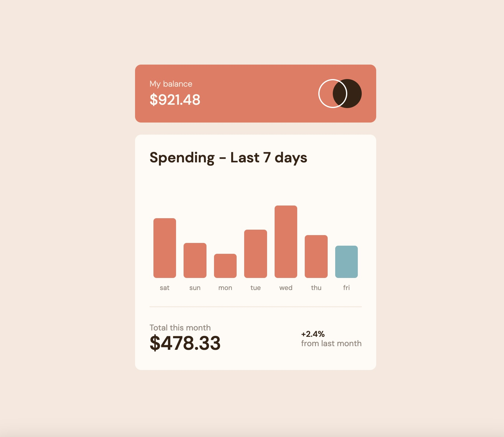

# Frontend Mentor - Expenses chart component solution

This is a solution to the [Expenses chart component challenge on Frontend Mentor](https://www.frontendmentor.io/challenges/expenses-chart-component-e7yJBUdjwt). Frontend Mentor challenges help you improve your coding skills by building realistic projects. 

## Table of contents

- [Overview](#overview)
  - [The challenge](#the-challenge)
  - [Screenshot](#screenshot)
  - [Links](#links)
- [Getting started](#getting-started)  
  - [Installation](#installation)
- [My process](#my-process)
  - [Built with](#built-with)
- [Author](#author)


### The challenge

Users should be able to:

- View the bar chart and hover over the individual bars to see the correct amounts for each day
- See the current day’s bar highlighted in a different colour to the other bars
- View the optimal layout for the content depending on their device’s screen size
- See hover states for all interactive elements on the page
- **Bonus**: Use the JSON data file provided to dynamically size the bars on the chart

### Screenshot



### Links

- Solution URL: [https://github.com/doehna/expenses-chart-component-main](https://github.com/doehna/expenses-chart-component-main)
- Live Site URL: [https://doehna.github.io/expenses-chart-component-main/](https://doehna.github.io/expenses-chart-component-main/)

## Getting started

To get a local copy up and running follow these simple example steps.

### Installation

- Clone the repo
git clone https://github.com/doehna/age-calculator.git

- Install NPM packages
```npm install```

- Start parcel server
```npm start```

## My process

### Built with

- Semantic HTML5 markup
- CSS custom properties
- Flexbox
- JSON
- SASS

## Author

- Website - [Dorota Wojdecka](https://github.com/doehna)
- Frontend Mentor - [@doehna](https://www.frontendmentor.io/profile/doehna)
